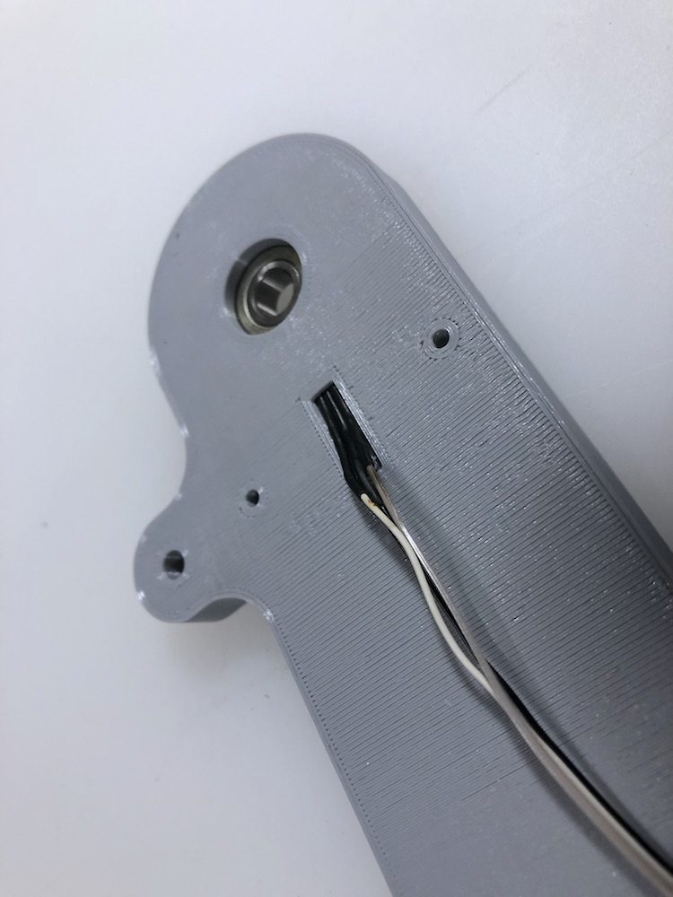
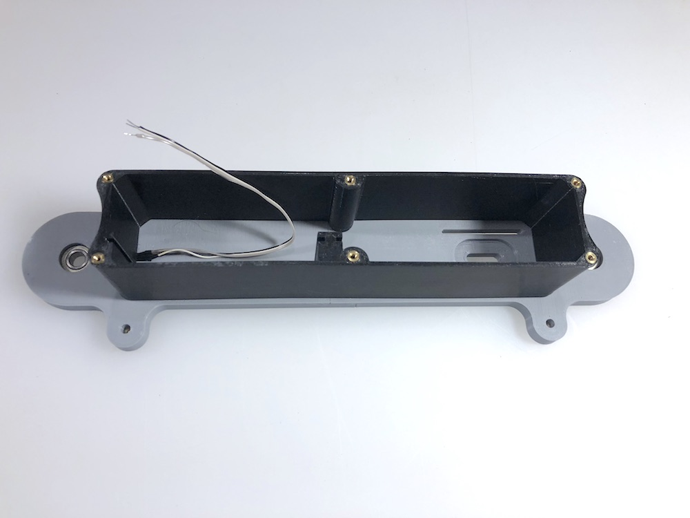
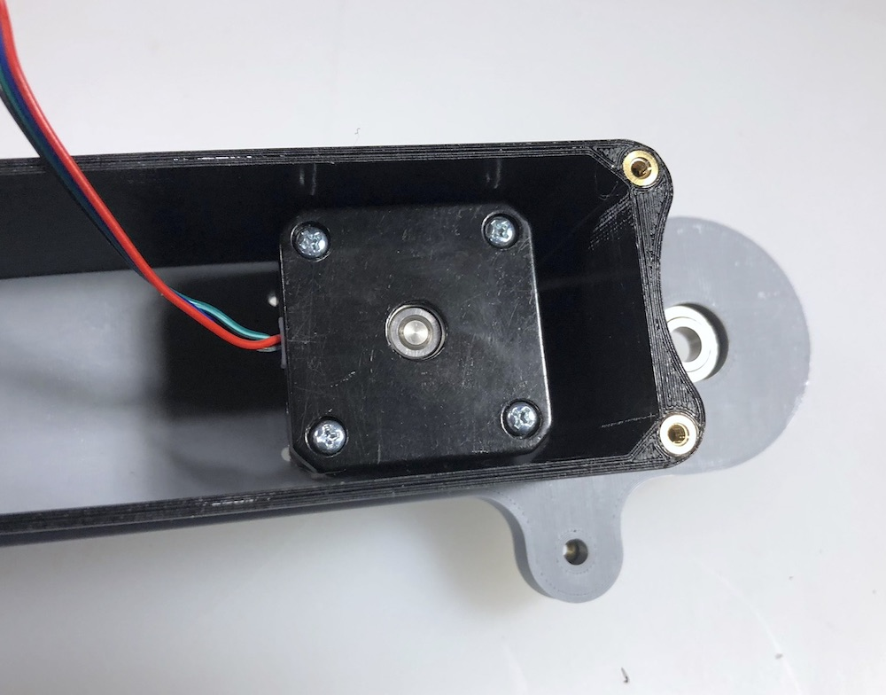
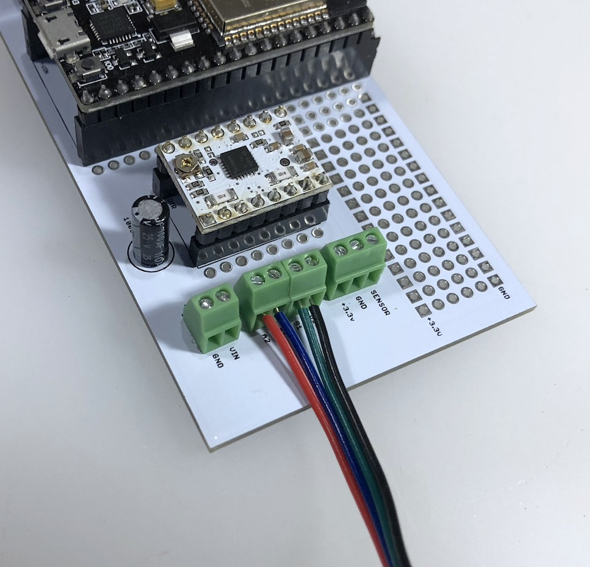
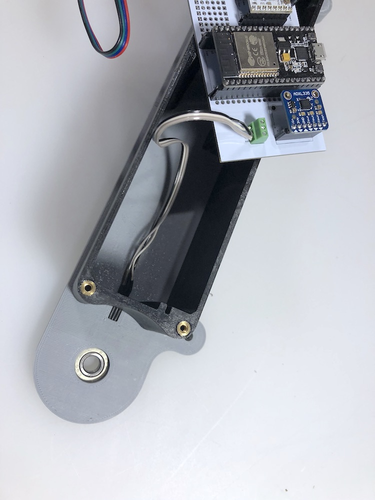
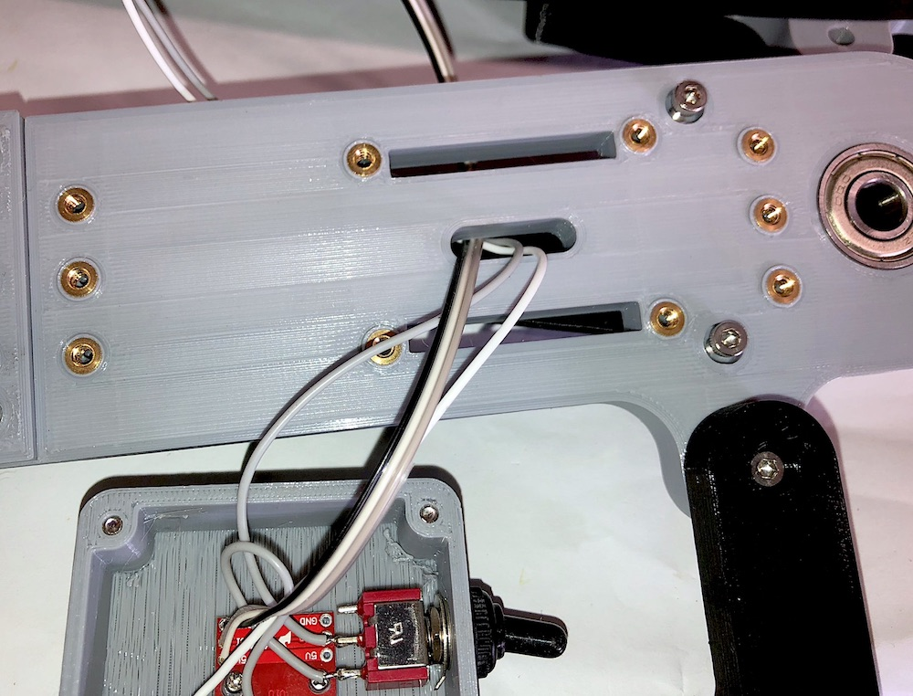
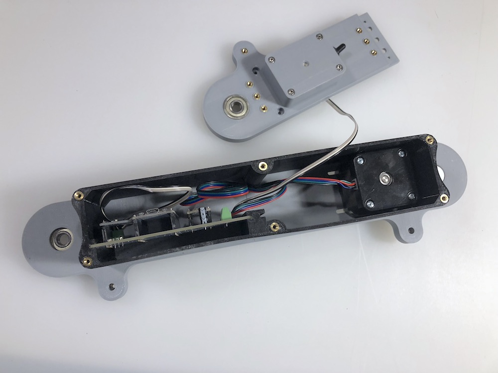
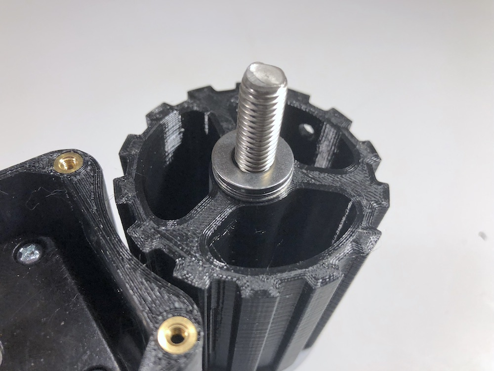
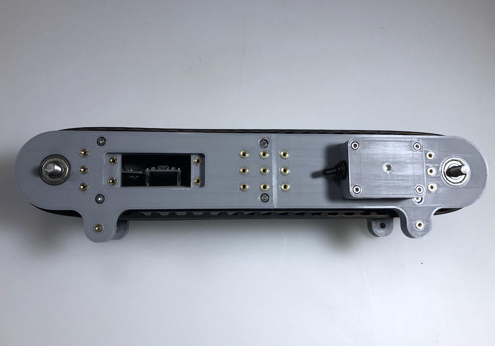
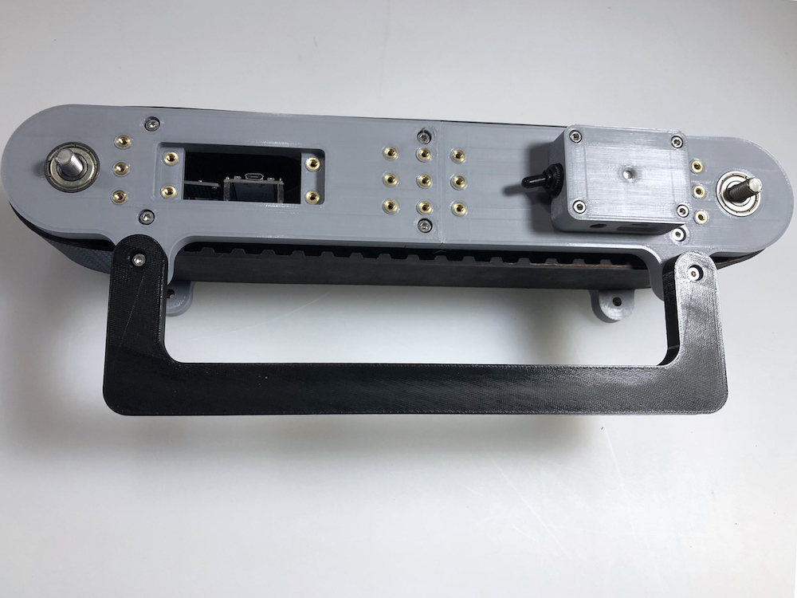

# Final Assembly
## 608 Bearing Installation
The front and back of pieces of the conveyor take four 608 bearings (two per side). Depending on how close to tolerance you were able to print the pieces you may have to ream out the the inner face of the bearing socket on the front and back with sand paper. If when the socket is close to tolerance you should be able to set the bearing most of the way by hand and then drive it flush by flipping the piece over and pressing the bearing onto a hard surface. Here's what it should look like when the bearing is seated flush in the socket:

## Hall Effect Sensor Installation

Once you have the bearings installed you can start putting the rest of the pieces together. Start by inserting the hall effect sensor assembly into the the small slot on the back side of the front piece of the belt. Make sure the front of the hall effect sensor is facing towards inside of the conveyor belt. You can tell which side of the sensor is the front because it is chamfered. Here's what it should look like when installed (note: the sensor should fit completely inside of the slot and no part of the black plastic should be exposed):

## Center Installation
Once the hall effect sensor is installed you can attach the center piece. The slots that will hold the circuit board should be positioned on the side where the hall effect sensor was installed. The 6mm M3 screws are used to attach the front piece to the center.

## Stepper Motor Installation

The front conveyor piece has a shallow cutout that allows the stepper motor to be adjusted side to side in order to tension the drive belt. To install the stepper motor press the motor into this cutout on the back side of the front piece. Note the wire direction in this example:

Once the stepper motor is pressed into the cutout flip the assembly around and affix the stepper to the front conveyor piece using 6mm M3 screws AND washers. 

## Wiring up the PCB

Now that you have the stepper motor and Hall effect sensor installed you can wire the stepper motor to the PCB. Note the color sequence for the stepper motor wires:

If you noted down the wires for the hall effect sensors wiring it to the RPM screw terminals on PCB should be straight forward.

To install the power cover (on/off switch and RGB LED) you will need to thread the power and LED wires through the slot on the back conveyor piece. 

The 5V and Ground wires are then attched using the "power" screw terminals on the PCB. If you are installing the RBC LED indicator you can use the the "sensor" screw terminals. 

Once you have everything wired up to the PCB screw terminals you can slide the PCB into the slots of the center piece. It should look something like this (note in this photo we are missing the power wires but you should get the idea):

## Belt Pulleys Installation

To install the belt pulleys you will need to shim the space between the 608 bearing and the face of the belt pulley with M8 washers. Basically fill the depression until the washers stick out slightly above the front piece (take note of how many washers you ). Also make sure you install the pulley with the embedded magnets facing the side with the hall effect sensor.

Once you have the pulleys seated in the front conveyor piece figure out how many washers you will need for each depression on the back conveyor piece and put them on each respective axle. 

## Install Conveyor Belt

Now that you have the pulleys installed in the conveyor front piece. You can slip the 300H200 belt onto the conveyor assembly. You will need to pass the back piece with power cover through the belt before you can slip it over the pulleys. 

Once the belt is over the pulleys you can attach the back piece to the rest of the conveyor assembly. The conveyor belt will be putting tension on the belt pulleys so you will need to spread the pulleys appart to get them to fit into the 608 bearings on the back piece. Attach the back piece to the center using 6mm M3 screws. 

You can now secure the axles with a M8 locking nut and washer. These should only be slightly snugged down against the 608 bearings as too much force will cause the front and back conveyor pieces to pinch the belt pulleys. Also do not install a nut on the axle that sticks out next to the stepper motor as you will be installing a GT2 toothed pulley on that axle.

## Install Legs

Using the 6mm M3 screws, install the legs to the leg mounts on the front and back of the conveyor belt. 

